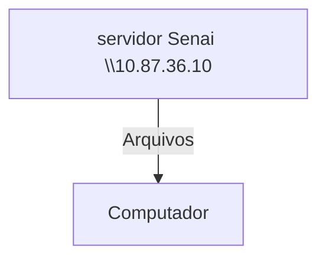
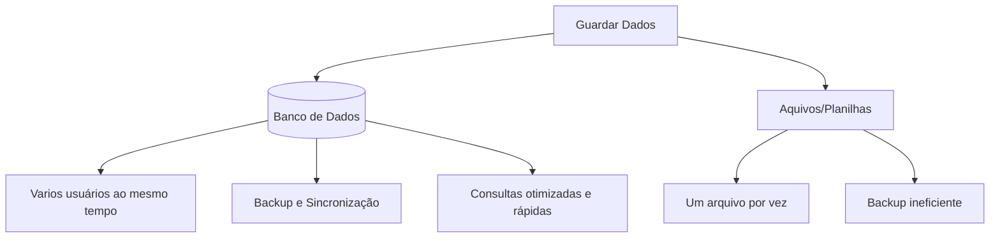

## Configuração do servidor educacional
O objetivo é simular um ambiente real de produção

---
**Objetivo**:
- Experiencia real de mercado,
- Administração de recursos,
- Experiencia em servidores Linux.

## Servidor de arquivos
Servidor educacional para arquivos, assim não dependendo da rede externa.


**Credenciais**:
- aluno
- aluno

--- 
## Servidor de Desenvolvimento
Cada aluno recebe seu própio acesso.
Cada maquina recebe um endereço de IP diferente

>**Meu SERVIDOR**: 192.168.10.21

|Recurso|Configuração|
|-------|------------|
|CPU|2 cores|
|RAM|512 MB|
|DISCO|6 GB|
|SISTEMA OPERACIONAL|Ubuntu 26.04 LTS|
|Acesso| SSH (Secure Shell)|

Dados de Acesso
|Campo|Valor|
|-----|-----|
|Ip do container|192.168.10.27|
|Usuario|Root|
|Senha inicial|aluno01

Comando para visualizar os os usos dos recursos:
```bash
htop
```
Comando para alterar a senha:
```bash
passwd
```
---

## Banco de Dados
- **Dados:** Informações isoladas que não dizem muita coisa. **Ex: Jogo, Escola, Dinheiro**
- **Informaçao:** Dados estruturados. **Ex: Joguei na escola por dinheiro**
- **Conhecimento:** O que podemos extrair a partir das informações. **Ex: Ele joga na escola**


---

O fluxo normal de um banco de dados está representado a seguir:

---
>Por qual razão, as empresas não salvam os dados em arquivos comuns?


---

## SGBD
Sistema gerenciador de Banco de Dados

Exemplos:
- PostgreSQL
- MySQL
- MsSQL
- Oracle DB
- SQLite

>POSTGRESQL: SGBD OpenSource e muito completo

Primeiro, começamos atualizando os pacotes:
```bash
sudo apt update && upgrade
```

Para instalação do Postgresql:
```bash
sudo apt install -y postgresql
```