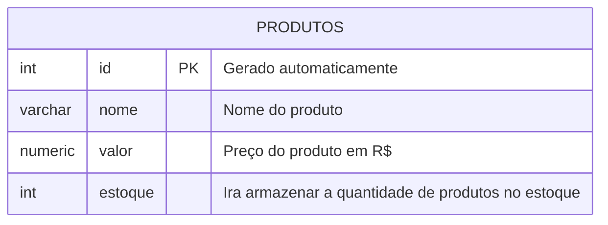
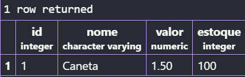

## Aula 03
Para apagar um bando de dados, utilizamos o comando:

```sql
DROP DATABASE nome do banco de dados;
```

>Não esquecer do ;

---

**Modelagem do banco de dados**


**Apos modelar, iremos executar as etapas de criação e inserção de dados.**
---

Para criar a primeira tabela, usamos os comandos:
```sql
CREATE TABLE produtos(
    id INT GENERATED ALWAYS AS IDENTITY PRIMARY KEY,
    nome VARCHAR(100) NOT NULL,
    valor NUMERIC(10,2) NOT NULL,
    estoque INT NOT NULL DEFAULT 0 
);
```

---

Para consultar a tabela, usamos o comando:
```sql
SELECT * FROM produtos;
```

---

Para inserir dados na tabela:
```sql
INSERT INTO produtos(nome,valor,estoque)
VALUES('Caneta','1.50','100');
```

Imagem de exemplo.