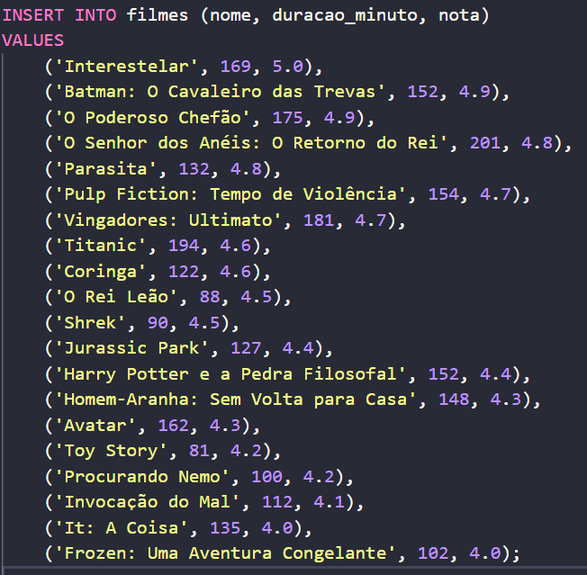

# Banco de Dados de Filmes

## Sobre a atividade

Nessa atividade eu fiz uma tabela para guardar algumas informações sobre filmes. Coloquei 20 filmes no banco de dados, junto com o nome, a duração em minutos e uma nota para cada um.

A ideia da atividade foi aprender e testar alguns comandos básicos do SQL, como criar uma tabela, cadastrar dados, fazer pesquisas, mudar informações e apagar registros.

## Criando a tabela

Pra começar, usei o `CREATE TABLE` para criar uma tabela chamada `filmes`:

```sql
CREATE TABLE filmes (
    id INT GENERATED ALWAYS AS IDENTITY PRIMARY KEY,
    nome VARCHAR(100) NOT NULL,
    duracao_minuto INT NOT NULL,
    nota NUMERIC(10,2) NOT NULL
);
```

Cada parte desse código tem uma função:

* `CREATE TABLE filmes` cria a tabela e coloca o nome dela como `filmes`;
* `id` é tipo o número de identificação de cada filme e é criado automaticamente;
* `PRIMARY KEY` não deixa dois filmes terem o mesmo `id`;
* `nome` guarda o nome do filme e permite até 100 caracteres;
* `duracao_minuto` guarda o tempo do filme em minutos;
* `nota` guarda a avaliação com casas decimais, como `4.9`;
* `NOT NULL` quer dizer que aquele espaço não pode ficar vazio.

## Adicionando os filmes

Depois de criar a tabela, usei o `INSERT INTO` para cadastrar os filmes. Esse é um pequeno exemplo:

```sql
INSERT INTO filmes (nome, duracao_minuto, nota)
VALUES
    ('Interestelar', 169, 5.0),
    ('Batman: O Cavaleiro das Trevas', 152, 4.9),
    ('O Poderoso Chefão', 175, 4.9);
```

O `INSERT INTO` mostra em qual tabela os dados serão colocados. Depois dele, coloquei as colunas na ordem: nome, duração e nota.

Cada filme precisa ficar dentro de seus próprios parênteses. Os nomes ficam entre aspas simples, mas os números não precisam. A vírgula separa um filme do outro e o ponto e vírgula encerra o comando.

No código completo, fiz isso com 20 filmes diferentes.

## Mudando uma nota

Também usei o `UPDATE` para mudar a nota de um filme que já estava cadastrado:

```sql
UPDATE filmes
SET nota = 4.0
WHERE id = 12;
```

Nesse código, o `UPDATE filmes` mostra qual tabela eu quero alterar. O `SET nota = 4.0` coloca a nova nota e o `WHERE id = 12` faz a mudança somente no filme que tem esse `id`.

O filme com o `id 12` era *Jurassic Park*. A nota dele era 4.4 e foi mudada para 4.0.

O `WHERE` é muito importante aqui. Sem ele, eu poderia acabar mudando a nota de todos os filmes sem querer.

## Procurando um filme

Pra conferir se a mudança realmente funcionou, usei este comando:

```sql
SELECT * FROM filmes WHERE id = 12;
```

O `SELECT` serve para pesquisar os dados. O `*` quer dizer que todas as colunas serão mostradas. Já o `WHERE id = 12` faz aparecer somente o filme com esse número.

## Apagando alguns filmes

Depois, usei o `DELETE` para apagar alguns filmes. Por exemplo:

```sql
DELETE FROM filmes WHERE id = 8;
```

Esse comando apaga somente o filme com o `id 8`, que era *Titanic*. Também apaguei os seguintes filmes:

* `id 6`: Pulp Fiction: Tempo de Violência;
* `id 13`: Harry Potter e a Pedra Filosofal;
* `id 4`: O Senhor dos Anéis: O Retorno do Rei.

No `DELETE`, o `WHERE` também é muito importante. Se eu usar o comando sem ele, posso acabar apagando todos os filmes da tabela.

## Mostrando todos os filmes

No final, usei este comando:

```sql
SELECT * FROM filmes;
```

Ele mostra todos os filmes que ainda estão na tabela. Como eu tinha colocado 20 filmes e apaguei cinco, sobraram 15.

Os IDs apagados não voltam e nem são reorganizados, mas isso é normal no banco de dados. Cada filme continua com o número que recebeu quando foi cadastrado.

## Sobre os comentários

No código, várias linhas começam com `--`, como nesse exemplo:

```sql
-- SELECT * FROM filmes;
```

Esses dois traços transformam a linha em um comentário. Ou seja, o banco de dados ignora aquela linha e não executa o comando.

Pra executar, é só tirar os dois traços:

```sql
SELECT * FROM filmes;
```

O melhor é executar uma parte de cada vez: primeiro criar a tabela, depois adicionar os filmes e, por último, testar o `UPDATE`, o `SELECT` e o `DELETE`.

## Conclusão

Com essa atividade, eu consegui entender melhor como funciona uma tabela em SQL. Aprendi a cadastrar vários filmes, pesquisar informações, mudar uma nota e apagar alguns registros.

Foi uma atividade simples, mas deu pra praticar bastante os comandos básicos e entender melhor como os dados ficam guardados dentro de um banco de dados.


## 1. Criação da tabela e inserção dos dados

Primeiro eu criei a tabela `filmes` (o código está comentado com `--`).

Depois rodei um `INSERT` e coloquei **20 filmes** de uma vez, com:
- nome
- duração em minutos
- nota

**Resultado:** a tabela ficou com 20 filmes cadastrados.

---



---
Fiz um `SELECT` e mostrei a tabela inteira com os 20 filmes e as notas originais.
---


---
```sql
UPDATE filmes
SET nota = 5.0
WHERE id = 16;
Atualizei a nota do filme Toy Story (id 16) para 5.0.
```


---

### Consultei o <b>Toy Story</b> e confirmei que a nota realmente mudou para 5.00.


### Atualizei a nota do <b>O Rei Leão</b> (id 10) para 4.90.


---

### Atualizei a nota de <b>It: A Coisa</b> (id 19) para 4.50.


---

### Atualizei a nota de <b>Vingadores: Ultimato</b> (id 7) para 5.00.


---

### Atualizei a nota de <b>Jurassic Park</b> (id 12) para 4.00.


---

Apareceram várias mensagens de 1 row deleted (ou seja, apaguei 5 filmes).
Depois mostrei o SELECT final:

Sobraram 15 filmes na tabela
Já com as notas atualizadas


