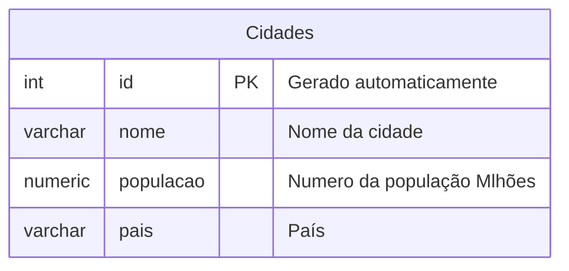

## Criação de tabela:
<!-- Criando tabela -->


---
>Para consultar a tabela:
<p>Segue o código abaixo:<p>

```sql
SELECT * FROM produtos;
```

---
>Para colocar dados na tabela:
<p>Segue o código:<p>

```sql
INSERT INTO produtos(nome,pais,populacao)
VALUES('Jacarta','Indonésia','41913860');
```

---

## Moba

>Para entrar no postgres:

```sql
sudo -u postgres psql
```

No postgres segue as instruções para criar o **banco de dados**:
```sql
CREATE DATABASE "nome do banco de dados";
```